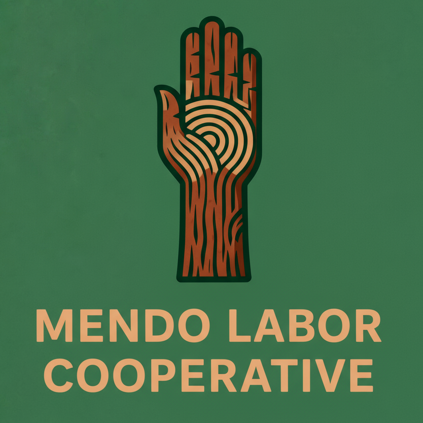

# Mendo Labor Cooperative Website

A modern, SEO-optimized website for the Mendo Labor Cooperative - unhoused workers organizing for economic justice in Mendocino County, California.



## 🎯 Overview

This is a Next.js website built for the Mendo Labor Cooperative, featuring:
- **Home page** - Mission, values, and calls-to-action
- **About page** - Cooperative story, approach, and what we do
- **Contact page** - Multiple ways to connect with the co-op
- Full SEO optimization with Google Analytics
- Mobile-responsive design with brand consistency
- Accessibility-first approach

Built with worker solidarity and designed to center the dignity of unhoused workers.

---

## 🚀 Quick Start

### Installation

```bash
# Install dependencies (using Yarn Berry)
yarn install

# Or if using npm
npm install
```

### Development Server

```bash
# Start development server
yarn dev

# Or with npm
npm run dev
```

Open [http://localhost:3000](http://localhost:3000) to view the site.

### Build for Production

```bash
yarn build
yarn start
```

---

## 📁 Project Structure

```
mendolaborcoop.ukiahumc.org/
├── pages/
│   ├── _app.tsx           # App wrapper
│   ├── _document.tsx      # HTML document (includes GA)
│   ├── index.tsx          # Homepage
│   ├── about.tsx          # About page
│   ├── contact.tsx        # Contact page
│   └── 404.tsx            # Error page
├── components/
│   ├── Layout.tsx         # Page layout wrapper
│   ├── NavBar.tsx         # Navigation component
│   └── Footer.tsx         # Footer component
├── styles/
│   └── globals.css        # Global styles & brand colors
├── public/
│   ├── mendo_labor_coop_logo.png
│   ├── mendo_labor_coop_logo_text.png
│   ├── mendo_labor_coop_favicon.png
│   ├── sitemap.xml        # SEO sitemap
│   └── robots.txt         # Search engine instructions
├── SEO_SETUP_GUIDE.md     # Detailed SEO instructions
└── README.md              # This file
```

---

## 🎨 Brand Design System

### Color Palette

Our cooperative uses earth-toned, justice-oriented colors:

| Color | Hex | Usage |
|-------|-----|-------|
| **Redwood** | `#7A3E2E` | Primary brand, headings, CTAs |
| **Moss** | `#39714B` | Navbar, accents (matches logo) |
| **Gold** | `#E2A673` | Highlights, warmth (from logo text) |
| **River** | `#2D637A` | Secondary accents |
| **Sand** | `#E6D9C7` | Light backgrounds |
| **Cream** | `#FAF7F2` | Primary backgrounds, text on dark |

### Typography

- **Font Family**: Public Sans (all weights)
- **Headlines**: Public Sans Bold (700) or Extrabold (800)
- **Body Text**: Public Sans Regular (400) or Semibold (600)
- **Logo Text**: ALL CAPS BOLD (matches logo aesthetic)

### Design Patterns

- **Border Accent**: Left border (8px) in brand colors on cards
- **Card Style**: White background, rounded-r-lg, shadow-md
- **Spacing**: py-16 for sections, mb-12 for section titles
- **Icons**: Emoji-based for accessibility and simplicity

---

## 📊 SEO & Analytics Setup

### Google Analytics 4 (GA4)

**⚠️ ACTION REQUIRED**: Replace placeholder tracking ID

1. **Get GA4 Tracking ID:**
   - Go to https://analytics.google.com
   - Create a property → Set up Web stream
   - Copy Measurement ID (format: `G-XXXXXXXXXX`)

2. **Update Tracking Code:**
   - File: `pages/_document.tsx`
   - Replace `G-XXXXXXXXXX` on lines 8 and 14

### SEO Features Implemented

✅ **Meta Tags**
- Title, description, keywords on every page
- Canonical URLs to prevent duplicate content
- Author, robots, and geo-location tags

✅ **Open Graph & Twitter Cards**
- Optimized social media previews
- Uses logo as preview image
- Works on Facebook, LinkedIn, Twitter/X

✅ **Schema.org Structured Data**
- CooperativeOrganization schema
- WebSite schema with search action
- BreadcrumbList for navigation
- Geographic data for Ukiah, CA

✅ **Technical SEO**
- Sitemap.xml (all pages listed)
- Robots.txt (search engine friendly)
- Performance optimizations
- Mobile-responsive design

### Next Steps - SEO Action Items

1. **Add GA4 Tracking ID** (see above)

2. **Google Search Console:**
   - Go to https://search.google.com/search-console
   - Add property: `mendolaborcoop.ukiahumc.org`
   - Verify ownership (DNS or HTML file)
   - Submit sitemap: `https://mendolaborcoop.ukiahumc.org/sitemap.xml`

3. **Update Social Media Links:**
   - File: `pages/index.tsx`
   - Update schema `"sameAs"` array with real Facebook/Instagram URLs

4. **Test SEO:**
   - Rich Results: https://search.google.com/test/rich-results
   - Mobile-Friendly: https://search.google.com/test/mobile-friendly
   - PageSpeed: https://pagespeed.web.dev/
   - Facebook Debugger: https://developers.facebook.com/tools/debug/
   - Twitter Validator: https://cards-dev.twitter.com/validator

---

## 🛠️ Tech Stack

- **Framework**: [Next.js 15](https://nextjs.org/) (Pages Router)
- **Language**: TypeScript
- **Styling**: [Tailwind CSS](https://tailwindcss.com/)
- **Package Manager**: Yarn Berry (v4.10.3)
- **Deployment**: Vercel-ready (or any Node.js host)
- **Analytics**: Google Analytics 4 (GA4)

### Key Dependencies

```json
{
  "next": "15.4.7",
  "react": "^19.0.0",
  "typescript": "^5",
  "tailwindcss": "^4.1.11"
}
```

---

## 🌐 Deployment

### Vercel (Recommended)

1. Push code to GitHub
2. Import repository to Vercel
3. Deploy automatically on every push to `main`

### Environment Variables

No environment variables required for basic deployment. Add GA4 tracking ID directly in code (see SEO section).

### Build Commands

```bash
# Build
yarn build

# Start production server
yarn start
```

---

## ♿ Accessibility

This site prioritizes accessibility:

- Semantic HTML structure (`<header>`, `<nav>`, `<main>`, `<section>`, `<footer>`)
- Proper heading hierarchy (h1 → h2 → h3)
- ARIA labels on interactive elements
- Alt text on all images
- Keyboard navigation support
- High color contrast ratios
- Mobile-responsive and touch-friendly

---

## 🔧 Development Notes

### Custom CSS Variables

Brand colors are defined in `styles/globals.css`:

```css
:root {
  --redwood: #7A3E2E;
  --moss: #39714B;
  --gold: #E2A673;
  --river: #2D637A;
  --sand: #E6D9C7;
  --cream: #FAF7F2;
}
```

Referenced in Tailwind via `tailwind.config.ts`:

```typescript
colors: {
  'redwood': 'var(--redwood)',
  'moss': 'var(--moss)',
  'gold': 'var(--gold)',
  // ...
}
```

### Logo Files

- **Full Logo**: `public/mendo_labor_coop_logo.png` (icon + text)
- **Logo Text Only**: `public/mendo_labor_coop_logo_text.png` (used in navbar)
- **Icon/Favicon**: `public/mendo_labor_coop_favicon.png`
- **Generated Favicons**: Various sizes for different devices

### Adding New Pages

1. Create page in `pages/` directory (e.g., `pages/new-page.tsx`)
2. Use Layout component for consistency
3. Update `public/sitemap.xml` with new URL
4. Add navigation link in `components/NavBar.tsx` if needed

---

## 📝 Content Management

### Updating Content

All content is directly in the React components (no CMS). To update:

1. **Homepage**: Edit `pages/index.tsx`
2. **About**: Edit `pages/about.tsx`
3. **Contact**: Edit `pages/contact.tsx`
4. **Footer**: Edit `components/Footer.tsx`
5. **Navigation**: Edit `components/NavBar.tsx`

### SEO Metadata

Update per-page SEO in the Layout component call:

```tsx
<Layout
  title="Your Page Title | Mendo Labor Cooperative"
  description="Your meta description here"
  keywords="custom, keywords, here"
>
```

---

## 🐛 Troubleshooting

### CSS Not Loading

If Tailwind styles aren't working:
```bash
# Clear Next.js cache
rm -rf .next

# Rebuild
yarn dev
```

### Port Already in Use

If port 3000 is taken:
```bash
# Use different port
yarn dev -p 3001
```

### TypeScript Errors

```bash
# Check types
yarn tsc --noEmit
```

---

## 📚 Additional Documentation

- **[SEO_SETUP_GUIDE.md](./SEO_SETUP_GUIDE.md)** - Comprehensive SEO instructions
- **[Next.js Documentation](https://nextjs.org/docs)** - Framework docs
- **[Tailwind CSS](https://tailwindcss.com/docs)** - Styling docs

---

## 🤝 Core Values

- **Solidarity**: Workers united in struggle for dignity and justice
- **Housing Justice**: Housing as a human right, not a commodity
- **Economic Democracy**: Worker control of workplaces and communities
- **Mutual Aid**: Direct action and resource sharing for community resilience

---

## 📄 License & Credits

This is a worker-owned project. The website centers the voices and needs of unhoused workers in Mendocino County.

**Worker power builds community power.**

*Mendo Labor Cooperative © 2025*

---

## 🆘 Need Help?

- **Technical Issues**: Create a GitHub issue
- **Content Updates**: Contact the cooperative
- **SEO Questions**: See SEO_SETUP_GUIDE.md

Built with ❤️ and ✊ by and for workers.
